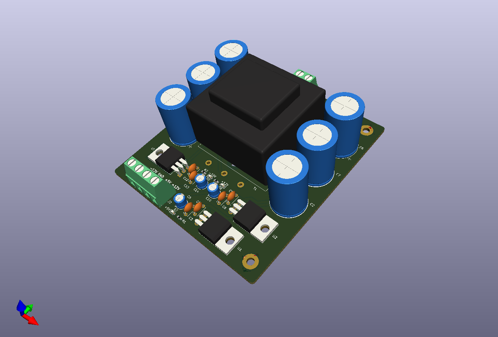
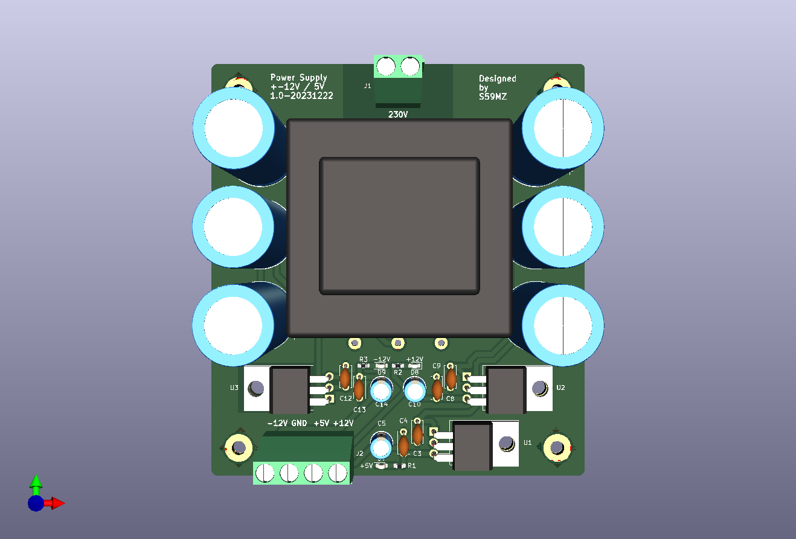
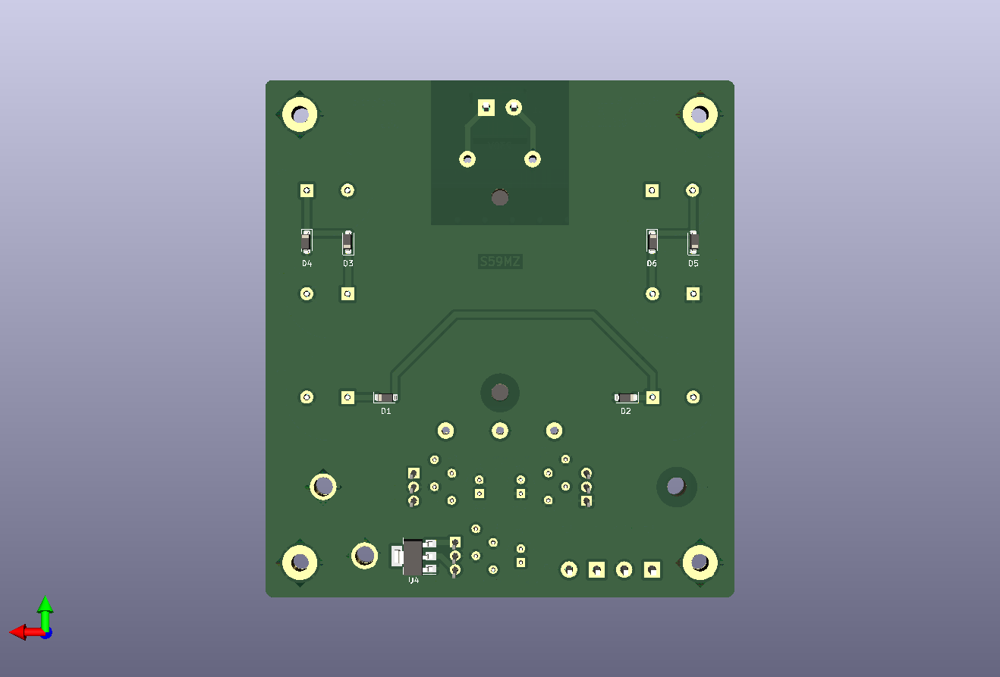

# kicad-trans_pwr
Simple Power Supply made by main transformer and voltage dubler.
It generates +12V, -12V and +5V voltages with linear voltage generators.

Schematic:
[kicad-trans_pwr.pdf](kicad-trans_pwr.pdf)

BOM:
[kicad-trans_pwr.csv](kicad-trans_pwr.csv)

Gerbers:
[gerbers.zip](https://github.com/s59mz/kicad-trans_pwr/raw/main/gerbers.zip)
